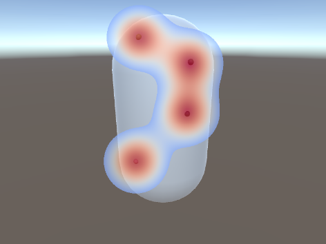

# Screen Saliency Drawer (in Unity)
Given points on a mesh, draw a heatmap in screen space over the object using two-passes of a 1D-gaussian filter ([SeparatedGaussianFilter](Assets/Shaders/SeparatedGaussianFilter.shader)).

After you've opened this project in Unity you will see a single capsule. Once the scene is started, you can click on the capsule and spheres will be added at the points of intersection of your mouse click on the capsule ([AddGazePointOnClick.cs](Assets/Scripts/AddGazePointOnClick.cs)).
A second script takes that 3D position and does the inverse projection and creates a saliency map in 2D screen space using *OnRenderImage* ([PostRenderSaliencyDrawer](Assets/Scripts/PostRenderSaliencyDrawer.cs)).

(the spheres should be hidden, they are here to demonstrate the process)

